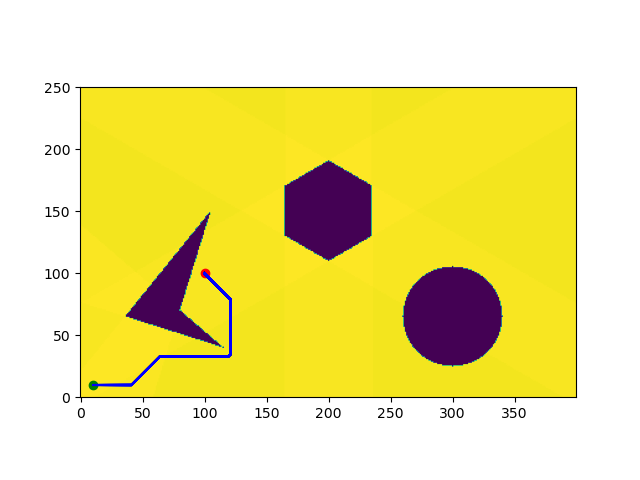

# Dijkstra Pathplanning | Maaruf Vazifdar | UID: 117509717

## Introduction

Dijkstra's Algorithm basically starts at the node that you choose (the source node) and it analyzes the graph to find the shortest path between that node and all the other nodes in the graph.

The algorithm keeps track of the currently known shortest distance from each node to the source node and it updates these values if it finds a shorter path. Once the algorithm has found the shortest path between the source node and another node, that node is marked as "visited" and added to the path. The process continues until all the nodes in the graph have been added to the path. This way, we have a path that connects the source node to all other nodes following the shortest path possible to reach each node.

## Software Requirements

1. Python 3
2. Numpy
3. Matplotlib
4. OpenCV 4

## Output Visualization


## Backtracked Path Example



## Steps to run code

1. Unzip the `Dijkstra-pathplanning-maaruf-vazifdar.zip` file .
2. Open a terminal and cd into the folder `Dijkstra-pathplanning-maaruf-vazifdar`.
3. To run the code:

    ```bash
    python3 Dijkstra-pathplanning-maaruf-vazifdar.py
    ```

4. Provide the starting x,y and goal x,y coordinates and enter 0,1 or 2 to visualize the output. (Visalising all explored nodes can take long time, so please be patient.)
